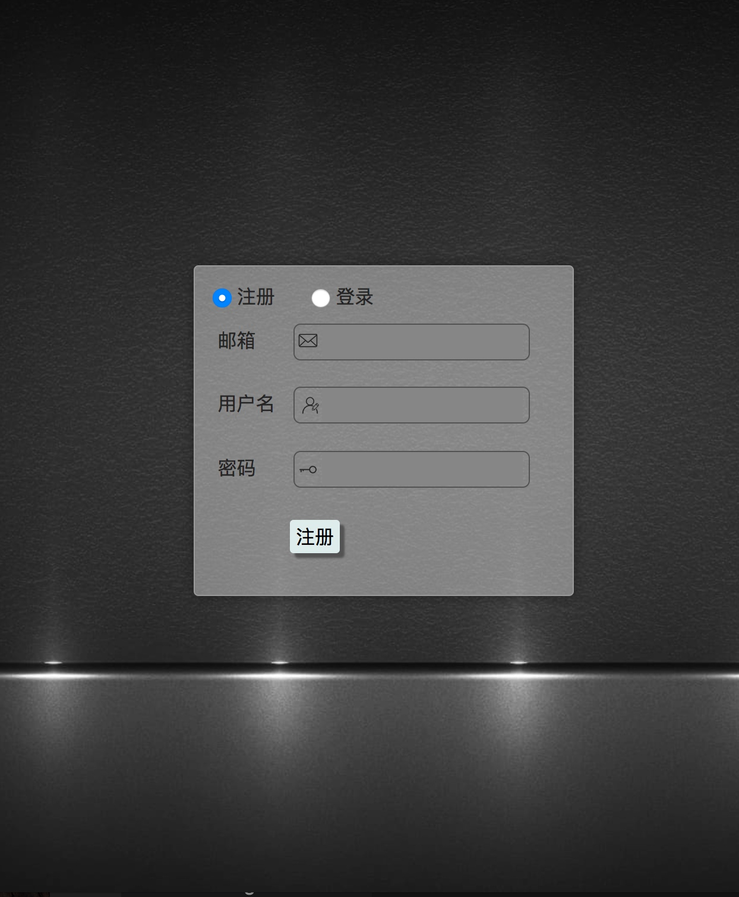
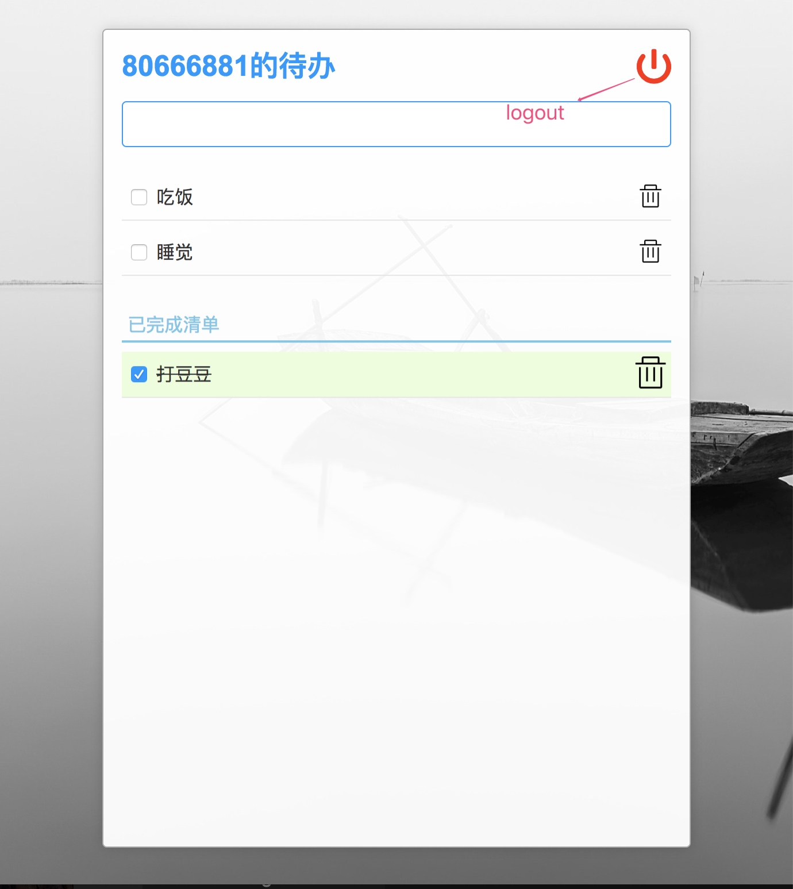

# react-todoList

>简介：这是一个用react制作的todo-list，使用了包括webpack，react，icon字体图标等方法。
数据存储选用leancloud提供的服务。

[leancloud地址](https://leancloud.cn/)

[预览地址](https://80666881.github.io/todoList-Reactjs/build/)

## 界面截图

### 登录/注册

### 内部界面（右上角提供logout按钮）

